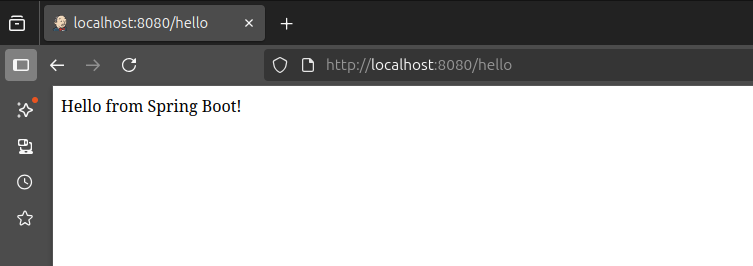
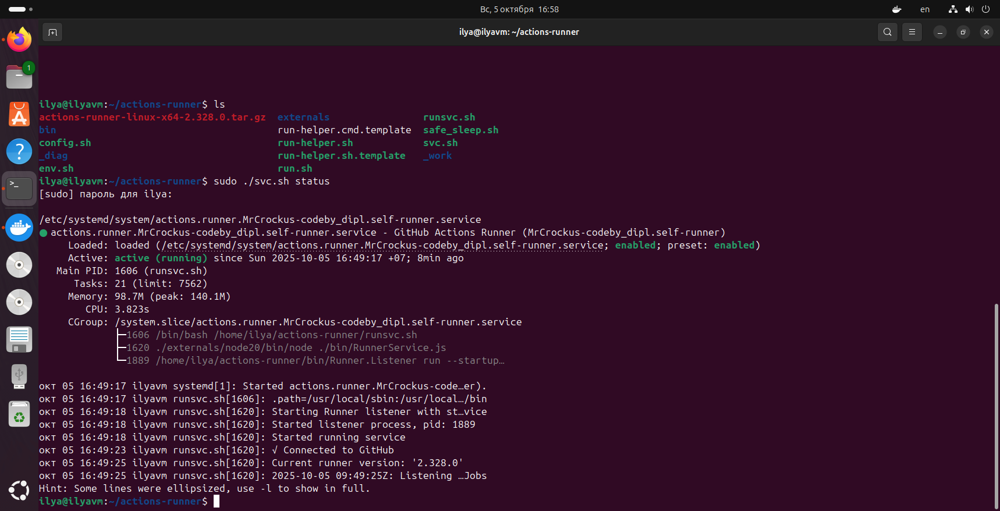
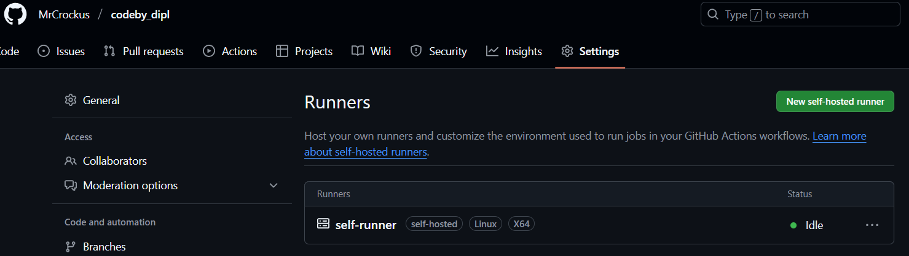
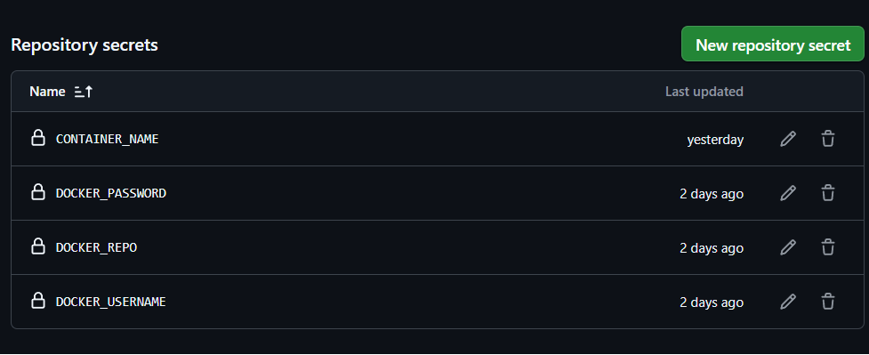
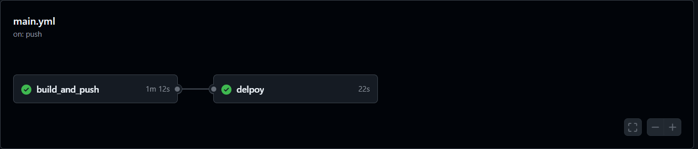
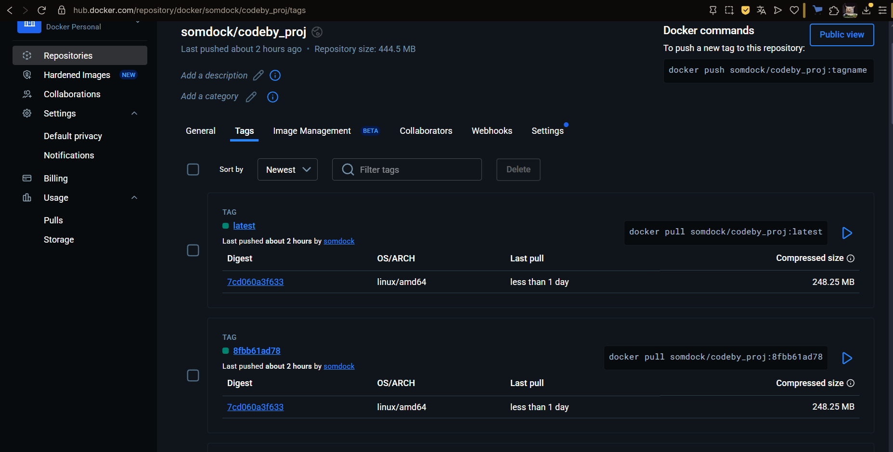
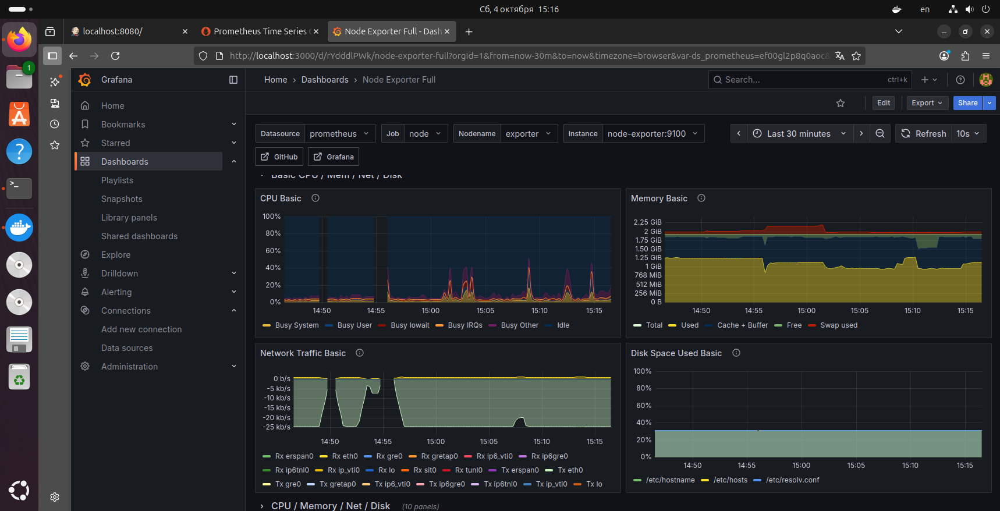
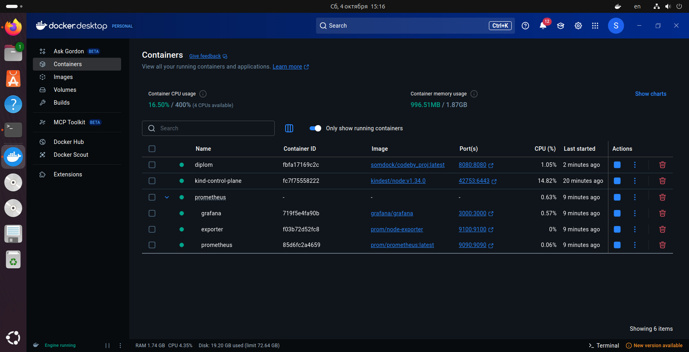

Проект по курсу DevOps: :wave:

Задача:
Реализовать полный цикл сборки-поставки приложения, используя практики CI/CD.

Для того, чтобы ничего не сломать в основной репе, все "махинации" проводились в отдельной репе:
[codeby_dipl](https://github.com/MrCrockus/codeby_dipl)

Работа представляет из себя следующее:
При переходе по ссылке по адресу, выводится такая страница.

<p align="center">

</p>

Предварительно необходим self-runner, чтобы запускался деплой приложения на хосте после пуша образа контейнера приложения:
self-runner на хосте запущен в виде сервиса.

<p align="center">

</p>

На Github статус self-runner должен выглядеть следущим образом:

<p align="center">

</p>

В качестве инструмента был выбран Github Actions.
Секреты хранятся в Github Actions secrets.
Используются следущие секреты:

<p align="center">

</p>

```
DOCKER_USERNAME - логин от DockerHub;
DOCKER_PASSWORD - пароль от DockerHub;
DOCKER_REPO - Репозиторий DockerHub, куда пушатся образы собранных контейнеров;
CONTAINER_NAME - наименование контейнера, который запускается на хосте.
```

Как работает:
При внесении изменений в ветку main (push/merge) запускается Actions workflow, который состоит из 2 задач:

<p align="center">

</p>

1. Создание образа контейнера и его пуш в репозиторий DockerHub (build_and_push), который реализует следующие этапы:
	- Выбирается ОС Ubuntu (с тэгом latest)
	- Устанавливается OpenJDK 17
	- Выполнятеся сборка приложения с помощью Maven
	- Собирается Docker образ с помощью Dockerfile
	- Авторизация в Docker
	- Пуш образа с 2-мя тэгами:
		- Тэг SHA::10 - 10 символов SHA коммита. Позволяет релизовать версионность приложения, которая позволяет, при необходимости, откатиться на предыдущие версии приложения.
		- Тэг latest - самый последний собранный образ

<p align="center">

</p>

2. 	Удаление с хоста предыдщей версии приложения и развертывание новой версии:
	- На хосте удаляется контейнер и образ контейнера приложения, при его наличии
	- С репозитория DockerHub устанавливается (пуллится) и зпускается актуальная версия приложения на порту 8080	

Об Dockerfile, который исопльзуется для сборки приложения:
Первый этап (stage build) использует Maven для сборки .jar.
Второй этап использует openjdk:17, в него копируется уже собранный .jar.
Приложение запускается с помощью команды java -jar app.jar.

Также реализован мониторинг на основе Node exporter, Prometheus и Grafanа.
Node exporter используется для сбора метрик с хоста где развернуто приложение.
Prometheus используется для сбора метрик с Node exporter на основе правил, которые указаны в prometheus.yml
Grafana используется для визуализации полученных данных/метрик.

Node Exporter собирает и хранит системные метрики по адресу: localhost:9100/metrics или node-exporter:9100/metrics. Prometheus с определенной периодичностью (указаны в правилах) собирает данные метрики. Grafana использует Prometheus как источник данных для их визуализации в виде Дашбордов (графиков). В качестве дашборда используется общедоступный дашборд "Node exporter full" (dashboard_id: 1860)

<p align="center">

</p>

Подсистема мониторинга реализована в виде образов контейнеров, которые собраны с помощью docker compose.

<p align="center">

</p>

docker-compose и promethus.yml для сборки подсистемы мониторинга приведены в директории "./monitoring"
[клик](https://github.com/MrCrockus/codeby-devops/diplom/monitoring)

Way: :lobster: :point_right:  :shark:

!--end!--
